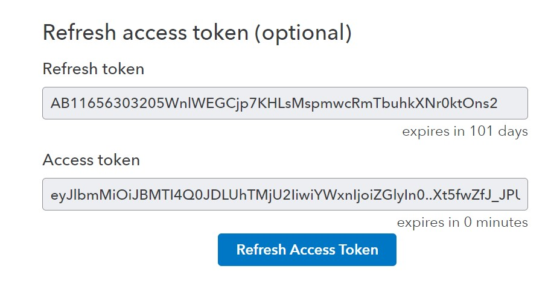

# Setup Instructions

(Please note that I have used a third party library for cofiguring quickbooks client along with intuit-oauth client. I have used them and modified them for my use case and don't own any copyrights for the same.)

1. To Clone the Repo:
   `https://github.com/sedhha/qb-oauth-python.git`
2. Cd into the root directory:
   `cd qb-oauth-python`
3. Setup the virtual Enviroment:
   `python -m venv quickbooksVenv`
4. Launch Virtual Enviroment
   For Linux:
   `source quickbooksVenv/bin/activate`
   For Windows:
   `quickbooksVenv/Scripts/activate`
5. Install [requirements.txt](requirements.txt)
   `pip install -r requirements.txt`
6. Get your all quickbooks credentials using oAuth 2.0 playground. Follow this [YT video](https://youtu.be/8ZFZhe2HoMY) for reference. Plug in these values to your [constants.py](constants.py).
7. Create `refresh-credentials.json` file in the root directory and put in the following variables that you collected from Intuit oAuth playground:

```
{
  "refresh_token": "XXXXXXXXXXXXXXXXXXXXXXXXXXXXXX",
  "x_refresh_token_expires_in": 0,
  "token_type": "bearer",
  "access_token": "XXXXXX",
  "expires_in": 0
}

```

You can keep `x_refresh_token_expires_in`, `expires_in` and `token_type` as in the above example. (0,0 and `bearer`)

These details are to be collected from Intuit oAuth Playground as shown in below screenshot:


8. You may now run [main.py](main.py) to see it in action. There are two functions to demonstrate fetching of customers and payments data. Note that Quickbooks API allows you to perform tasks beyond that as well.

9. You can use `refresh_token` and set it to run every N seconds to refresh the token. Note that max token age is 3600s (1 hr), so in order to do ensure correct renewal you must schedule it to happen within less than 3600s. You can use cron job or a cloud function to do the same. Alternatively you can also use a while loop like this:

```
while True:
   time.sleep(N) # N is the Renewal Frequency in seconds
   refres_token()
```

Note: Please don't forget to update redirect_uri and environment in [constants.py](constants.py) in case you're shipping your app in production.

```
client_secrets = {
    "client_id": "XXXXXXXXXXXXXXXXXXXXXXXXXXXXXXXXXXXXXXXXXXX",
    "client_secret": "XXXXXXXXXXXXXXXXXXXXXXXXXXXXXXXXXXXXXX",
    "redirect_uri": "https://developer.intuit.com/v2/OAuth2Playground/RedirectUrl",
    "environment": "sandbox"
}
```
